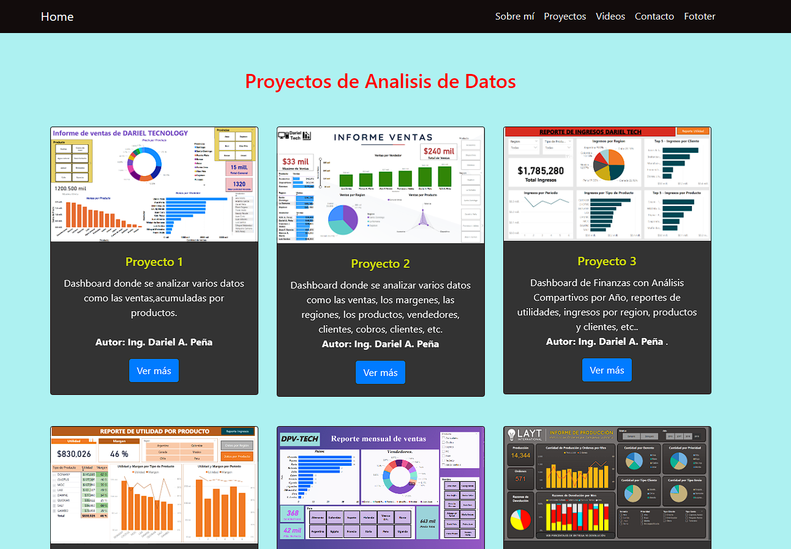
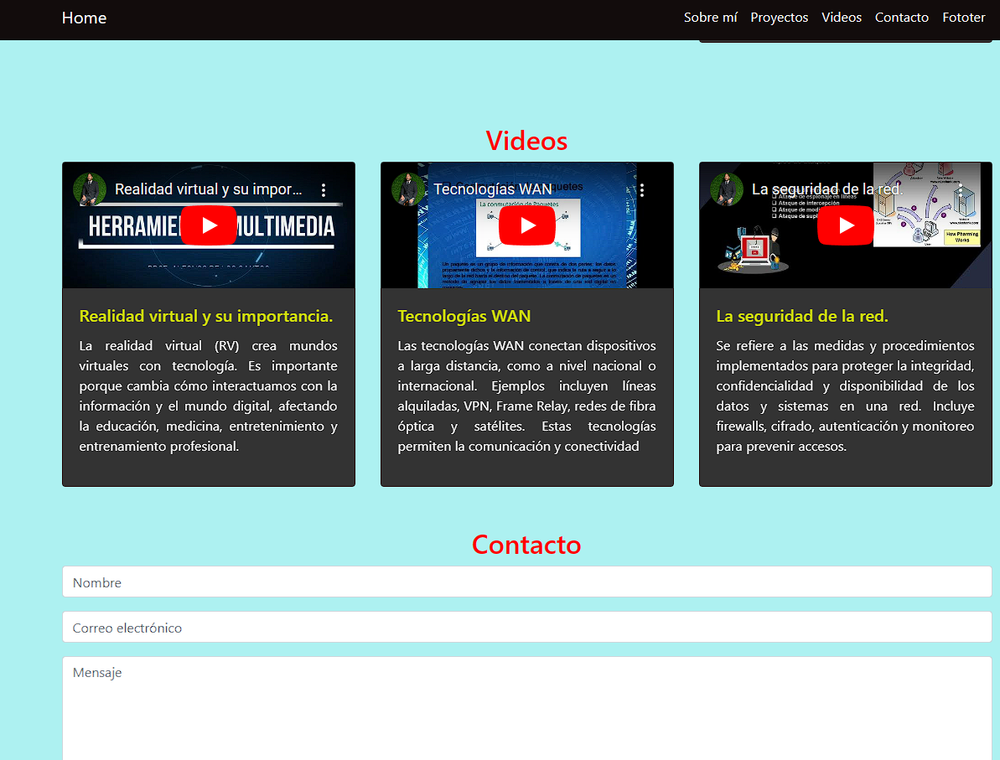

# Archivo HTML de Ejemplo

## Características Destacadas

- Uso de Bootstrap para la estructura del menú de navegación.
- Secciones para Sobre mí, Proyectos, Videos y Contacto.
- Incorporación de íconos de Font Awesome.
- Estilos personalizados para cambiar el aspecto de la página.

## Foto Web:

## Foto Web:

## Foto Movil:

### URL del Proyecto: https://darieladolfo.github.io/Portafolio_Dariel/

Siéntete libre de utilizar este archivo como referencia o punto de partida para tu propio proyecto web.

**Nota:** Asegúrate de tener acceso a las bibliotecas de Bootstrap y Font Awesome para que la página funcione correctamente.
